<div class="middle center title">
<div style="width: 100%">


<span style="text-align: center; font-size: 1.8em; font-weight: 600">Project 6</span>

<span style="text-align: center; font-size: 2.5em; font-weight: 600">Texture Packing</span>

<hr/>

Group 2: 黄星尧 钱梓洋

Reporter: 钱梓洋

Date: 2024/12/03


<!--s-->
<div class="middle center">
<div style="width: 100%">

# Part 1. Introduction


<!--v-->
## Problem Description

The project require us to design **approximation algorithms** running in polynomial time to solve **Texture Packing** problem. We can regard it as a **2-dimension bin packing**, with items("rectangle texture" in the problem) and bins("resulting texture" in the problem) having both width and height, but we only need a single bin with **bounded width** and **unbounded height**, and we should keep the bin with a (nearly) minimum height.


<!--v-->
## BL Algorithm

BL(Bottom-up left-justified) algorithm was first described by Baker et al.It works as follows:
BL(Bottom-up left-justified) algorithm was first described by Baker et al.It works as follows:

Let $L$ be a sequence of rectangular items. The algorithm iterates the sequence in the given order. For each considered item $r \in L$ , it searches for the bottom-most position to place it and then shifts it as far to the left as possible. Hence, <u>it places at the bottom-most left-most possible coordinate $(x, y)$ in the strip</u>.
Let $L$ be a sequence of rectangular items. The algorithm iterates the sequence in the given order. For each considered item $r \in L$ , it searches for the bottom-most position to place it and then shifts it as far to the left as possible. Hence, <u>it places at the bottom-most left-most possible coordinate $(x, y)$ in the strip</u>.


<!--v-->
## FFDH Algorithm

Just like texture packing problem is the 2D version of bin packing problem, the **FFDH** (i.e. First-Fit Decreasing-Height) algorithm is also the 2D version of FFD algorithm in bin packing problem. 

- It's an **offline algorithm**, which means that the algorithm doesn't process the input data unless it gets all input data, and in our algorithm, all items should be sorted by their height in a decreasing order.
- Before placing the current item, the algorithm scans the levels from bottom to top in the bin, then <u>places the item in the first level where it will fit</u>. 
- A new level will be created only if the item does not fit in any previous ones.

<!--v-->
## A Demo for FFDH Algorithm

<div style="text-align: center">
  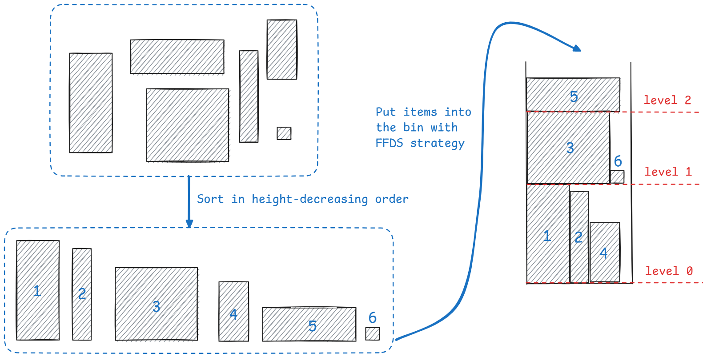
</div>


<!--s-->
<div class="middle center">
<div style="width: 100%">

# Part 2. Algorithm Specification


<!--v-->
## BL Algorithm

<!--v-->
## BL Algorithm 

Data structure:

```cpp
// structure of a single item
struct POINT{
    double x;
    double y;
    double width;

    //Overload the equal operator
    bool operator==(const POINT& other)
    {
        return x==other.x 
          && y==other.y 
          && width==other.width;
    };
};
```


<!--v-->
## BL Algorithm (Con.)

Pseudocode:

<div style="text-align: center; margin-top: -30px">
  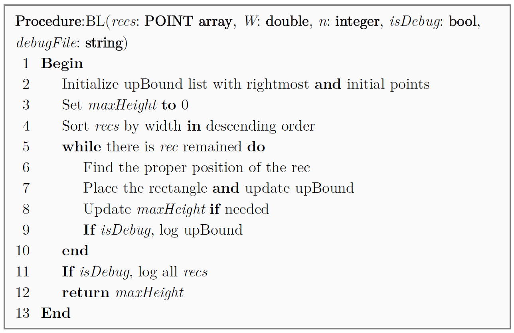
</div>

<!--v-->
## Approximation Ratio of BL Algorithm

**Conclusion**: BL algorithm is a 3-approximation algorithm.

**Proof**:

- $h^*$: the height of the lower edge of a tallest piece
- $h_{\text{BL}} = h^* + y$
- $A$: the region of the bin up to height $h^*$
- Suppose $A$ is at least half occupied. Then we have $h_{\text{OPT}} \ge \text{max}(y,h^*/2)$
  - $y \gt h^*/2$: $\frac{h_{\text{BL}}}{h_{\text{OPT}}} \le \frac{y+h^*}{y} \lt \frac{y+2y}{y}=3$
  - $y \le h^*/2$: $\frac{h_{\text{BL}}}{h_{\text{OPT}}} \le \frac{h^*/2+h^*}{h^*/2}=3$

<!--v-->
## Proof of Approximation Ratio (Con.)

Now let's prove that $A$ is at least half occupied.

We assert that for every horizontal line in area $A$, the sum of the lengths of the lines crossing the rectangle must be no less than the sum of the lengths of the lines crossing the blank area.

1. Each horizontal line must pass through a rectangle attached to the left edge. 

<!--v-->
## Proof of Approximation Ratio (Con.)

2. Assuming that the horizontal line $l$ passes through a blank area $S$, 
  - it is guaranteed by 1 that there must be a rectangle on its left. 
  - Secondly, it is obvious that the width of the rectangle on the left is greater than the width of $S$, which is guaranteed by the fact that the width of the rectangle placed in the upper layer must be greater than $S$ (if not, $S$ can be placed in a new rectangle, and the width of the upper rectangle is not greater than the rectangle on the left of $S$)

<!--v-->
## FFDH Algorithm

Data structure:

<div class="mul-cols">
<div class="col" style="width: 130%">


```cpp
// structure of a single item
typedef struct item {
    double width;     
    double height;
    double x;          
    double y;      
} Item;
```

</div>
<div class="col" style="width: 70%">

<div style="text-align: center">
  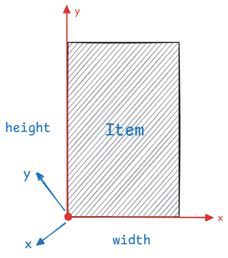
</div>

</div>


<!--v-->
## FFDH Algorithm (Con.)

Parameters and return values of the algorithm:

**Inputs**:

- *W*: Fixed width of the bin(i.e. resulting texture)
- *n*: The number of items
- *rect*: Multiple rectangle texture, i.e. items
- *isDebug*: Flag of debug mode
- *outFile*: Flag of file output mode

**Outputs**:

- *curHeight*: the "minimum" height of the bin 

Here is the **pseudocode**~

<!--v-->
## FFDH Algorithm (Con.)

<div style="text-align: center; margin-top: -20pt">
  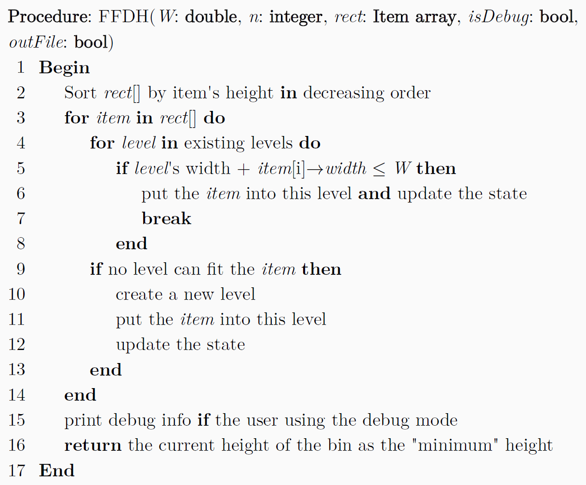
</div>


<!--v-->
## FFDH Algorithm (Con.)

We can divide the procedure into four steps:

1. Sort all items by their height in decreasing order.
2. For all items, put them into the bin in the sorted order.
   - Scan all levels from bottom to top, find the first level that can accomodate the current item.
   - If no levels can fit it, then create a new level and put it into the new level.

<!--v-->
## FFDH Algorithm (Con.)

3. (if necessary)Print the debug info, including:
    - the height-decreasingly sorted item data,
    - the occupied-by-items width for each level,
    - the positions of items.
4. Return the current height of the bin as the "minimum" height.


<!--v-->
## Approximation Ratio of FFDH Algorithm

Now we should figure out the approximation ratio of this algorithm. It was proved that FFDH algorithm is a **2.7-approximation algorithm** (the conclusion is given by [Wikipedia](https://en.wikipedia.org/wiki/Strip_packing_problem#First-fit_decreasing-height_(FFDH))). Because it is difficult for us to prove this approximation ratio based on our mathematical knowledge, and the relevant proof content cannot be directly checked on the Internet (need to pay to unlock the paper), so unfortunately the proof part is omitted.


<!--s-->
<div class="middle center">
<div style="width: 100%">

# Part 3. Test Results

<!--v-->
## BL Algorithm -- Correctness Tests

<div class="mul-cols">
<div class="col">

**Input 1**: Input: 10 squares with a side length of 6 and the width is 20

</div>
<div class="col" style="width: 120%">

<div style="text-align: center">
  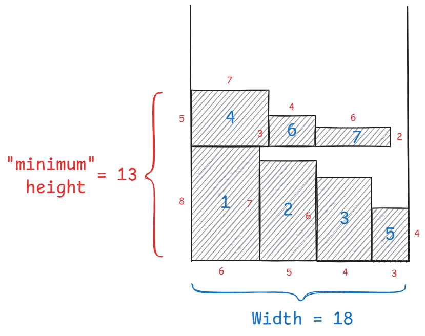
</div>

</div>
</div>

<!--v-->
## FFDH Algorithm -- Correctness Tests

**Input 1**:

- Purpose: check the correctness in **the normal case, with relatively small waste space**.

```txt
18 7
6 8
5 7
4 6
7 5
3 4
4 3
6 2
```

<!--v-->
## Correctness Tests (Con.)

**Output 1**:

<div class="mul-cols">
<div class="col" style="width: 100%">

<div style="text-align: center">
  
</div>

<div style="text-align: center; margin-top: 18pt; margin-left: 50pt">Expected Result</div>

</div>
<div class="col" style="width: 100%">

<div style="text-align: center">
  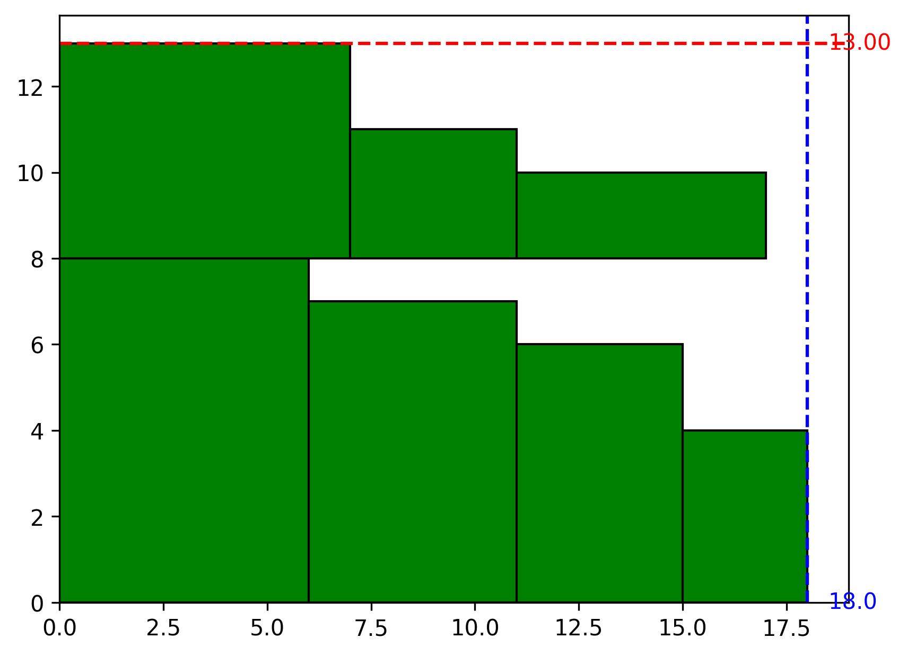
</div>

<br>
<div style="text-align: center">Actual Result</div>

</div>

<!--v-->
## Correctness Tests (Con.)

**Input 2**:

- Purpose: check the correctness in **the normal case, with relatively large waste space**.

```txt
18 6
6 7
15 5
17 3
4 10
2 6
13 4
```

<!--v-->
## Correctness Tests (Con.)

**Output 2**:

<div class="mul-cols">
<div class="col" style="width: 100%">

<div style="text-align: center">
  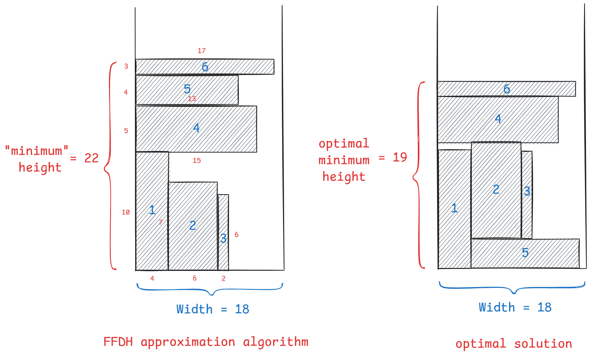
</div>

<div style="text-align: center; margin-top: 40pt; margin-left: 50pt">Expected Result</div>

</div>
<div class="col" style="width: 100%">

<div style="text-align: center">
  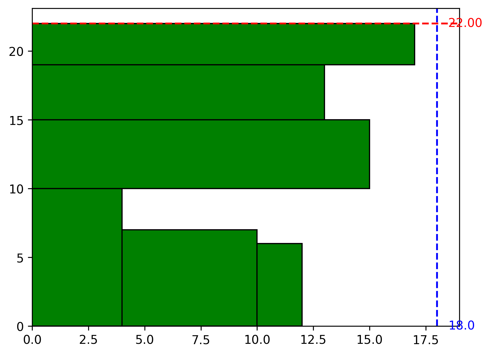
</div>

<br>
<div style="text-align: center">Actual Result</div>

</div>

<!--v-->
## Correctness Tests (Con.)

**Input 3**:

- Purpose: check the correctness in **the normal case, with relatively large waste space**.

```txt
20 10002
2 10000
2 2
18 1
18 1
18 1
......
18 1
18 1
```

<!--v-->
## Correctness Tests (Con.)

**Output 3**: check the correctness in **the large-scale case, with very large waste space**. 

<div class="mul-cols">
<div class="col" style="width: 100%">

<div style="text-align: center">
  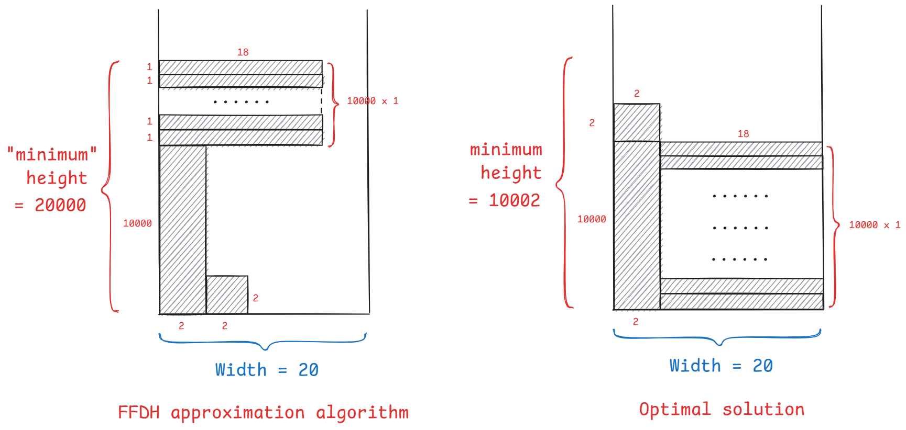
</div>

<div style="text-align: center; margin-top: 68pt; margin-left: 40pt">Expected Result</div>

</div>
<div class="col" style="width: 100%">

<div style="text-align: center">
  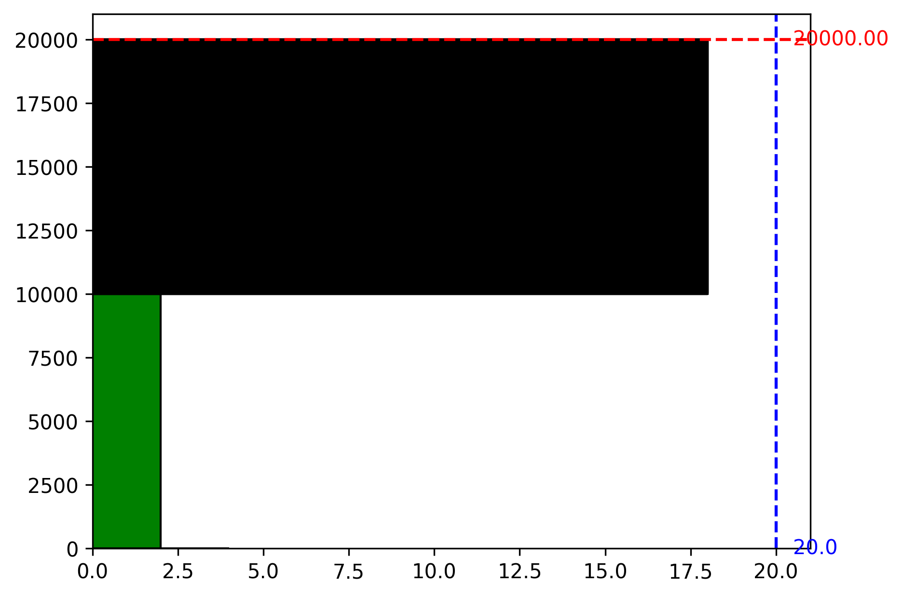
</div>

<br>
<div style="text-align: center">Actual Result</div>

</div>

<!--v-->
## Performance Tests

We will show the correlation between **run time** and **input sizes** by running our program in distinct input sizes, which are listed in the test table with corresponding results below:

<div style="text-align: center">
  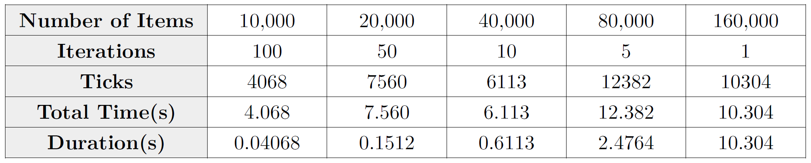
</div>


<!--v-->
## Performance Tests (Con.)

Based on the table above, we draw the curve diagram, representing the time complexity of FFDH algorithm in a graphic and direct way.

<div style="text-align: center; margin-top: -32pt">
  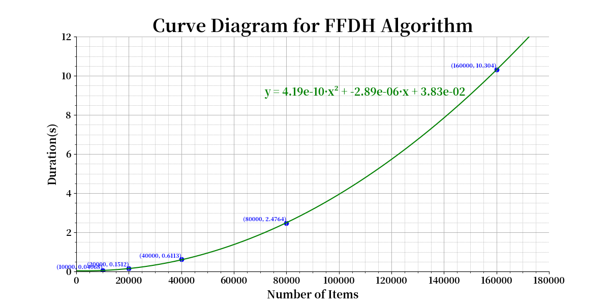
</div>

<!--v-->
## Performance Tests (Con.)

We use a **quadratic polynomial curve** fitting data point:

$$
y = 4.19 \times 10^{-10} x^2 + 2.89 \times 10^{-6} x + 3.83 \times 10^{-2}
$$

that can pass almost all the data points, which shows that the FFDH algorithm can complete the calculation within the **quadratic polynomial time**. 


<!--s-->
<div class="middle center">
<div style="width: 100%">

# Part 4. Analysis and Comments

<!--v-->
## Space Complexity

**Conclusion**:

- BL algorithm:
- FFDH algorithm: $O(N)$, $N$ is the number of items.

<!--v-->
## BL Algorithm


<!--v-->
## FFDH Algorithm

- Except the single variables, we have used some arrays, including `rect[]`, `curWidth[]` and `pos[]`, which contain the infomation of items, current width for each level and the position of each item respectively. 

- Apparently, the level is less than or equal to the number of items(we use $N$ to represent it). 

- As a consequence, these three arrays are proportional to $N$, and the total space is less than $c \cdot N$, when $c$ is just a constant.


<!--v-->
## Time Complexity

**Conclusion**:

- BL algorithm:
- FFDH algorithm: $O(N^2)$, $N$ is the number of items.


<!--v-->
## BL Algorithm


<!--v-->
## FFDH Algorithm

- Built-in function `qsort()`:
    - the average time complexity of quicksort is $O(N log N)$
    - the worst time complexity is $O(N^2)$

- FFDH algorithm: it consists of a loop with two layers: 
  - the outer one corresponds to $N$ directly
  - the inner one is controlled by `level` ($\le N$) 
  
  So the overall time consumption of the loop is less than $c N^2$, when $c$ is a constant.

- printing the debug info: $O(N)$

In a nutshell, the total time complexity is $O(N^2)$

<!--v-->
## Further Improvement

<!--s-->
<div class="middle center title">
<div style="width: 100%">

# Thanks for Watching!

<hr/>

Any Questions?